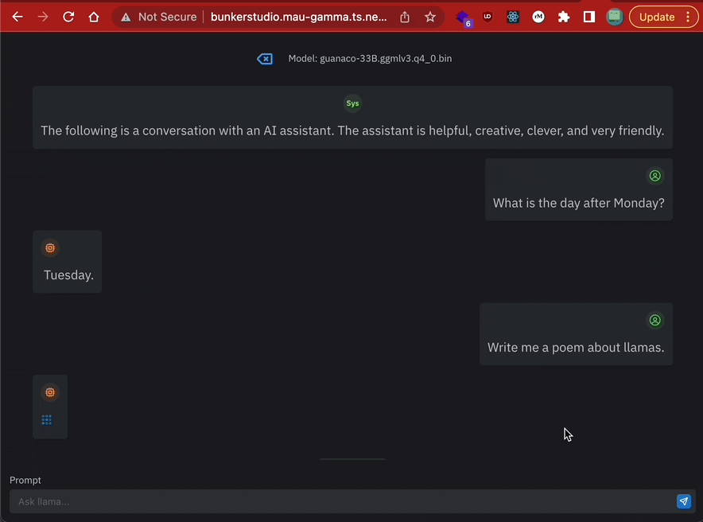
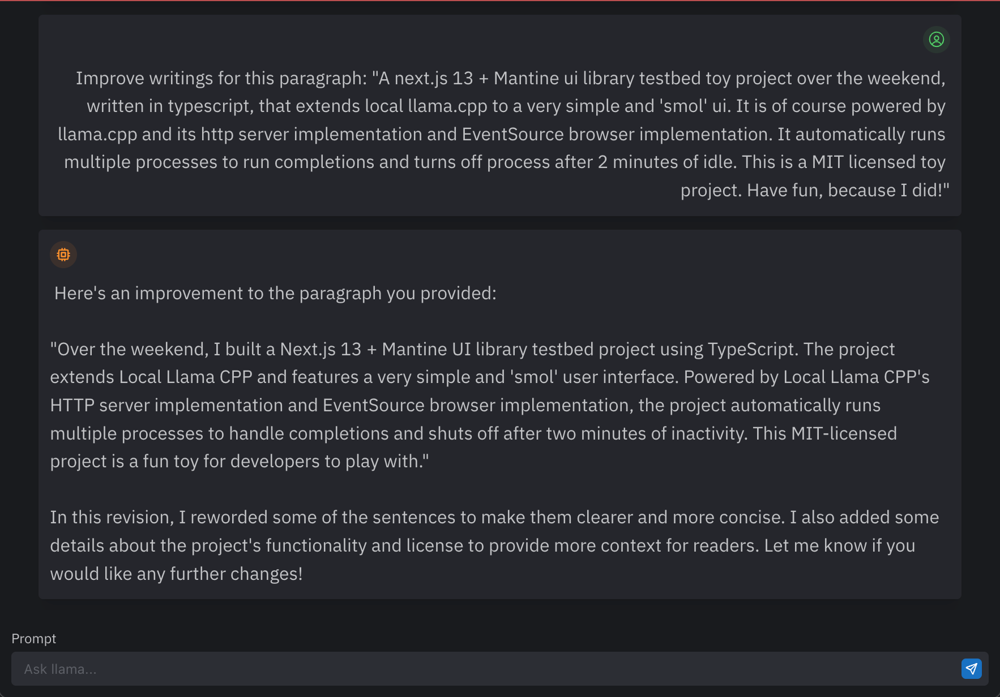

# Smol Llama Runner



Over the weekend, I built a Next.js 13 + Mantine UI library testbed project using TypeScript. The project extends Local Llama CPP and features a very simple and 'smol' user interface. Powered by Local Llama CPP's HTTP server implementation and EventSource browser implementation, the project automatically runs multiple processes to handle completions and shuts off after two minutes of inactivity. This MIT-licensed project is a fun toy for developers to play with.



## Instructions:

- Clone the repository using git: `git clone https://github.com/zenyr/smol-llama-runner.git` and build llama.cpp
- Install node.js and yarn on your system
- Open a terminal in the root directory of the project
- vi .env.local and fill in following dir & filenames
  ```
  REPO=your-llama.cpp-repo
  MODELS=your-ggml-folder
  SQL=your-clone-of-this-repo/prompts.db
  ```
- Run `yarn` to install all necessary dependencies
- Start the server by running `yarn build && yarn start`
- Navigate to http://localhost:3000/ in your web browser to see the application running.

## Dependencies:

- Next.js 13
- Mantine UI Library
- Llama.cpp
- Node.js 16+

Author: zenyr

License: MIT
